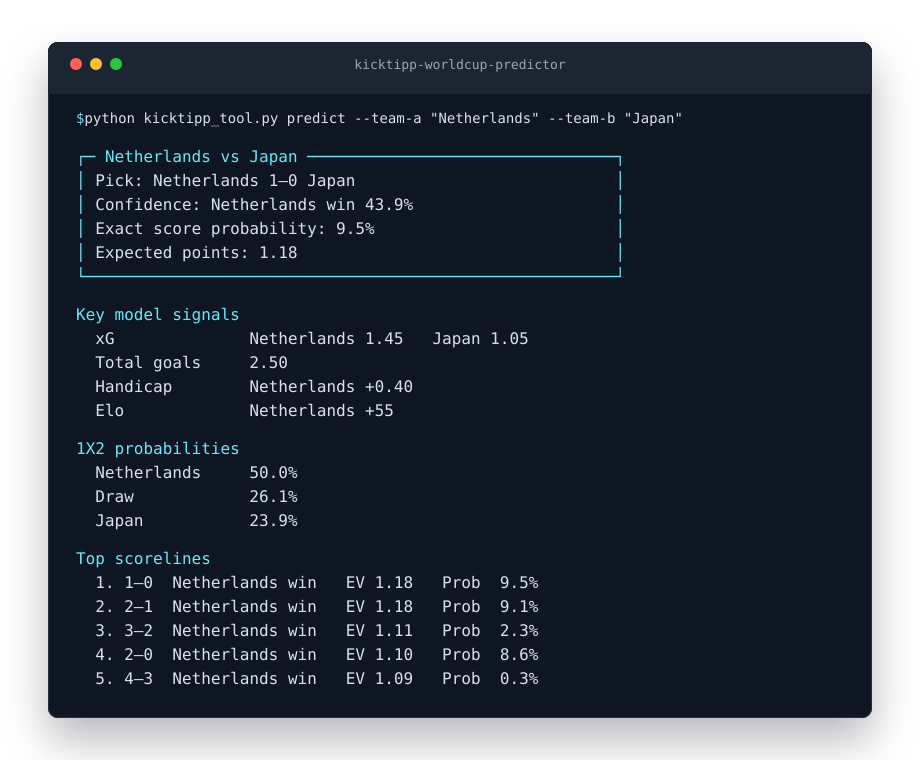

# Kicktipp World Cup Predictor

Local Python CLI for ranking football score predictions by expected Kicktipp
points. It combines 1X2 probabilities, expected total goals, Elo ratings, and
optional spread markets into a Poisson score model, then scores every candidate
tip with Kicktipp's points logic.

The tool is designed for World Cup matches, but it can be used for other
football competitions when the configured data sources support them.

## Preview



## Default Usage

For a quick prediction, pass the two teams and the match date:

```bash
python kicktipp_tool.py predict \
  --team-a "some team" \
  --team-b "another team" \
  --match-date 2026-06-11
```

With the default settings, the tool:

- tries every configured probability source
- reuses fresh cached API responses
- loads Elo ratings from `data/elo_ratings.csv`
- falls back to the remote Elo source if a local rating is missing

If none of the configured APIs can provide an expected total-goals line, add
`--total-goals` yourself:

```bash
python kicktipp_tool.py predict \
  --team-a "some team" \
  --team-b "another team" \
  --match-date 2026-06-11 \
  --total-goals 2.45
```

To ignore reusable cache data and fetch fresh API responses, add `--refresh`.

## What It Does

- fetches match probabilities from The Odds API, football-data.org, or
  API-Football, depending on what is configured and available
- derives expected total goals from Over/Under markets when possible
- uses balanced spread markets from The Odds API to model stronger favorites
  more realistically
- loads Elo ratings from local CSV data, a remote Elo table, or manual inputs
- converts the inputs into expected goals for both teams
- builds a normalized score-probability matrix, by default up to 6:6
- ranks all candidate tips, by default up to 5:5, by expected Kicktipp points
- prints the best tip, expected points, exact-score probability, tendency
  probability, and top alternatives

## What It Does Not Do

This is not a certainty engine. It optimizes a Kicktipp tip against modeled
probabilities and the Kicktipp scoring rules. Prediction quality depends on the
quality and freshness of odds, team news, injuries, lineups, and ratings.

The tool deliberately does not guess expected total goals when neither a market
line nor a manual value is available. Total goals strongly shape the score
distribution, so silent fallback values would make the recommendation look more
confident than it is.

## Why Expected Points Matter

Kicktipp does not only reward exact scores. A `1:0` prediction can still score
points for other home wins with the same tendency or goal difference. Because of
that, the best Kicktipp tip can differ from the single most likely exact score.

The model optimizes this value:

```text
EV(tip) = sum P(actual score) * KicktippPoints(tip, actual score)
```

## Installation

```bash
python -m venv .venv
source .venv/bin/activate
pip install -e ".[dev]"
```

## API Keys

Copy `.env.example` to `.env` and add the keys you have:

```bash
cp .env.example .env
```

```dotenv
THE_ODDS_API_KEY=your_key
FOOTBALL_DATA_API_KEY=your_key
API_FOOTBALL_KEY=your_key
```

The automatic probability lookup tries these sources in order:

1. The Odds API
2. football-data.org
3. API-Football predictions

If a source is not configured, does not find the match, or needs missing context
such as `--match-date`, the tool tries the next source.

## Data Sources

### The Odds API

The default sport key is `soccer_fifa_world_cup`. For other competitions, pass a
valid The Odds API sport key such as `soccer_epl`.

```bash
python kicktipp_tool.py predict \
  --team-a "some team" \
  --team-b "another team" \
  --match-date 2026-06-11 \
  --use-odds-api \
  --odds-sport-key soccer_fifa_world_cup
```

The tool requests `h2h`, `spreads`, and `totals` markets. `h2h` provides 1X2
probabilities, `totals` can provide the expected total-goals line, and `spreads`
can provide an expected goal difference. When spreads are unavailable, the model
falls back to the more conservative 1X2-based derivation.

### football-data.org

Use a match ID when you know it:

```bash
python kicktipp_tool.py predict \
  --team-a "some team" \
  --team-b "another team" \
  --use-football-data \
  --football-data-match-id 123456
```

Or pass `--match-date YYYY-MM-DD` so the tool can search the daily match list.

### API-Football

Use a fixture ID when you know it:

```bash
python kicktipp_tool.py predict \
  --team-a "some team" \
  --team-b "another team" \
  --use-api-football \
  --api-football-fixture-id 123456
```

Or pass `--match-date YYYY-MM-DD` so the tool can find the fixture before
loading API-Football predictions.

## Manual Overrides

Manual 1X2 probabilities and total goals take precedence over API data:

```bash
python kicktipp_tool.py predict \
  --team-a "some team" \
  --team-b "another team" \
  --p-a 0.36 \
  --p-draw 0.29 \
  --p-b 0.35 \
  --total-goals 2.45
```

Manual Elo values also override local and remote Elo data:

```bash
python kicktipp_tool.py predict \
  --team-a "some team" \
  --team-b "another team" \
  --p-a 0.36 \
  --p-draw 0.29 \
  --p-b 0.35 \
  --total-goals 2.45 \
  --elo-a 2113 \
  --elo-b 2081
```

Use `--max-goals` to control the modeled score matrix and `--tip-max-goals` to
control the highest candidate tip score.

## Output Modes

For automation, use JSON output:

```bash
python kicktipp_tool.py predict \
  --team-a "some team" \
  --team-b "another team" \
  --p-a 0.36 \
  --p-draw 0.29 \
  --p-b 0.35 \
  --total-goals 2.45 \
  --json
```

For scripts that only need the recommended score, use `--quiet`. It prints only
the tip, for example `1:1`.

## Match-Day Predictions

Use `predict-day` to generate a compact report for a whole World Cup match day
or round without entering every team yourself:

```bash
python kicktipp_tool.py predict-day --match-day "Match day 1"
```

The command loads the cached 2026 World Cup fixture schedule, selects the
requested match day or round, and predicts every fixture whose teams are known.
Match days and rounds are based on the `round` names in the fixture file, such
as `Matchday 1`, `Round of 32`, `Semi-final`, and `Final`.
Input matching is intentionally loose, so these are equivalent for the group
phase:

```bash
python kicktipp_tool.py predict-day --match-day 1
python kicktipp_tool.py predict-day --match-day "Match day 1"
```

Knockout fixtures whose teams are not known yet are displayed as pending instead
of being predicted:

```text
Predictions for Semi-finals

No ready fixtures to predict yet.

Pending fixtures
21:00  Winner Quarter-final 1 vs Winner Quarter-final 2
```

Refresh the cached fixture schedule once knockout participants are known:

```bash
python kicktipp_tool.py predict-day \
  --match-day "Semi-finals" \
  --refresh-fixtures
```

Write a report to a file when you do not want multiple predictions printed in
the terminal:

```bash
python kicktipp_tool.py predict-day \
  --match-day "Match day 1" \
  --output predictions-match-day-1.md
```

Use `--fixtures path-or-url` to override the default fixture source with another
[OpenFootball-style JSON file](https://github.com/openfootball/worldcup.json/blob/master/2026/worldcup.json).

## Cache Behavior

Without `--refresh`, API and remote Elo responses are reused only while the
cache file is still fresh. The default TTL is 24 hours. Older cache entries
trigger a new request automatically.

```bash
python kicktipp_tool.py predict \
  --team-a "some team" \
  --team-b "another team" \
  --match-date 2026-06-11 \
  --cache-dir /tmp/kicktipp-cache \
  --cache-ttl 6
```

`--cache-ttl` is measured in hours. `--no-cache` disables both reading and
writing cache files.

## Elo Ratings

The default local Elo file is `data/elo_ratings.csv`:

```csv
team,elo
Argentina,2113
France,2081
```

Elo is enabled by default. If a team rating is missing, the tool continues with
a neutral Elo value. Use `--no-elo` to disable Elo loading.

The Elo priority order is:

1. manual `--elo-a` and `--elo-b`
2. local `--elo-path` CSV, defaulting to `data/elo_ratings.csv`
3. remote Elo data, defaulting to `international-football.net` for the current
   date

You can point `--elo-url` at another CSV or HTML source when it contains one of
the supported formats, such as `team,elo`, `country,rating`, `club,elo`, or a
ranked table like `1. Team 2139`.

```bash
python kicktipp_tool.py predict \
  --team-a "some team" \
  --team-b "another team" \
  --elo-url "https://www.international-football.net/elo-ratings-table?day=04&month=06&year=2026"
```

## Fixtures

`data_sources.load_fixtures_from_openfootball(path_or_url)` can load
OpenFootball JSON from a local path or URL. The CLI stays focused on generating
tips, so fixture loading is exposed as an adapter for custom workflows.

## Tests

```bash
python -m pytest
ruff check .
mypy .
```

## Project Map

- `kicktipp_tool.py`: CLI and prediction workflow
- `models.py`: Poisson model, lambda derivation, and typed result models
- `scoring.py`: Kicktipp points, expected value, and ranking
- `data_sources/cache.py`: cache paths, TTL handling, reads, and writes
- `data_sources/elo.py`: local and remote Elo ratings
- `data_sources/fixtures.py`: OpenFootball fixture loading
- `data_sources/providers/`: The Odds API, football-data.org, and API-Football
- `data_sources/team_matching.py`: alias, accent, and fuzzy team matching
- `config.py`: `.env` configuration
